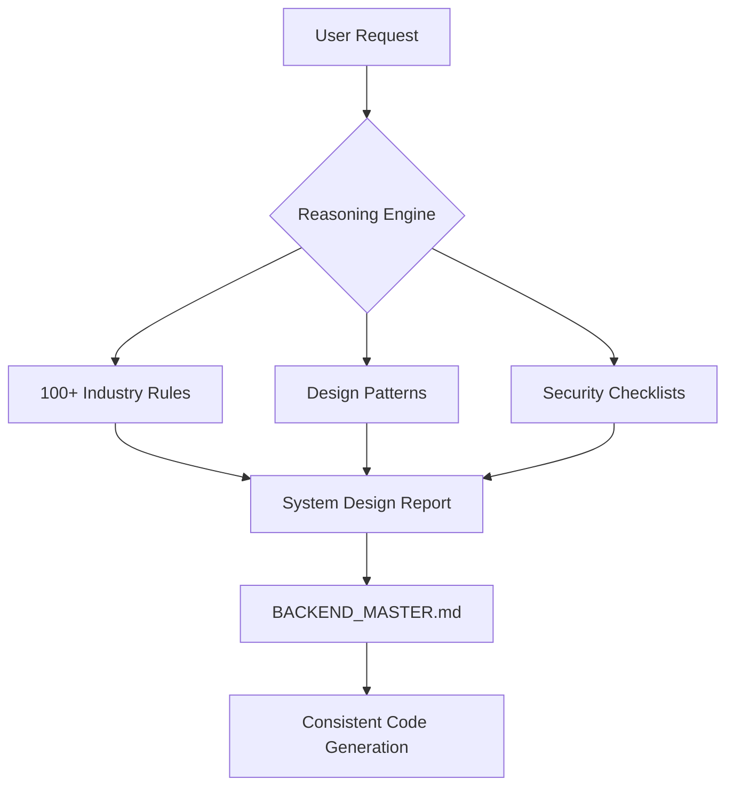

# 🧠 Backend Pro Max Skill v2.0 (Extreme Detail)

> **The Ultimate Backend Intelligence Hub for AI Coding Agents.**
> **Copyright © 2026 Odin from Dsoft Team.**
> Level up your AI from "Coder" to "Senior Backend Architect" with research data covering 100+ industries.

---

## 🚀 Key Features (v2.0)

### 1. Intelligent System Design Generation
AI reasoning engine that automatically analyzes project requirements and provides comprehensive recommendations: Architecture, Stack, Database, Security, and Anti-patterns.

### 2. 100+ Industry-Specific Reasoning Rules
In-depth reasoning data for various sectors:
- **Finance**: Fintech, Banking, Crypto, Trading.
- **Healthcare**: EHR, Telemedicine, Pharma.
- **SaaS**: Micro SaaS, B2B Enterprise, DevTools.
- **Emerging**: AI/ML, Web3, IoT, Quantum Computing.

### 3. Architecture Persistence (`BACKEND_MASTER.md`)
Maintains a "Source of Truth" for project architecture across chat sessions, ensuring the AI never forgets critical design decisions.

---

## 🛠️ Installation (3 Methods)

### 🚀 Method 1: One-line Installer (Recommended - No Node.js required)
Instant installation with a single command.

**Windows (PowerShell):**
```powershell
iwr -useb https://raw.githubusercontent.com/dsoftodin22999/backend-promax-skill/main/install.ps1 | iex
```

**Mac / Linux:**
```bash
curl -fsSL https://raw.githubusercontent.com/dsoftodin22999/backend-promax-skill/main/install.sh | sh
```

### 📦 Method 2: NPM CLI (Standard for Node.js devs)
If you have Node.js installed:
```bash
npx backend-promax-skill init
```

### 📂 Method 3: Internal Script
If you downloaded the source locally:
```powershell
.\install_to_project.ps1 -TargetProject "C:\path\to\your-project"
```

---

## 🧩 Multi-Platform Support (11 AI Agents)

| AI Assistant | How to Use |
| :--- | :--- |
| **Antigravity** | Use Slash Commands `/backend-pro-max`, `/backend-db`, `/backend-secure` |
| **Cursor IDE** | Automatic via `.cursorrules` or type `@Rules /reason` |
| **Claude Code** | Automatically recognized via `.claude/skills/` |
| **Windsurf** | Integrated via `.windsurf/workflows/backend-promax.md` |
| **Trae IDE** | Compatible via `.trae/skills/backend-promax/` |
| **GitHub Copilot** | Integrated via `.github/prompts/backend-promax.prompt.md` |
| **Gemini CLI** | Automatic via `.gemini/skills/backend-promax/` |
| **Roo Code** | Integrated via `.roo/rules/backend-promax.md` |
| **Kiro** | Integrated via `.kiro/steering/backend-promax.md` |
| **Qoder** | Integrated via `.qoder/skills/backend-promax.md` |
| **Codex CLI** | Integrated via `.codex/skills/backend-promax/` |

---

## 🎨 System Architecture



---

## 💡 "Pro Max" Command Examples

- `/backend-pro-max "Fintech" "MoneyGuard"` (Generate professional Fintech architecture)
- `/backend-db "Time-series data for IoT"` (Pick optimal database for IoT)
- "Based on v2.0 rules, design the Idempotency logic for this payment system."

---
> [!IMPORTANT]
> Backend Pro Max v2.0 doesn't just write code; it **designs systems**. Ensure your project always meets Senior standards for reliability and performance.
