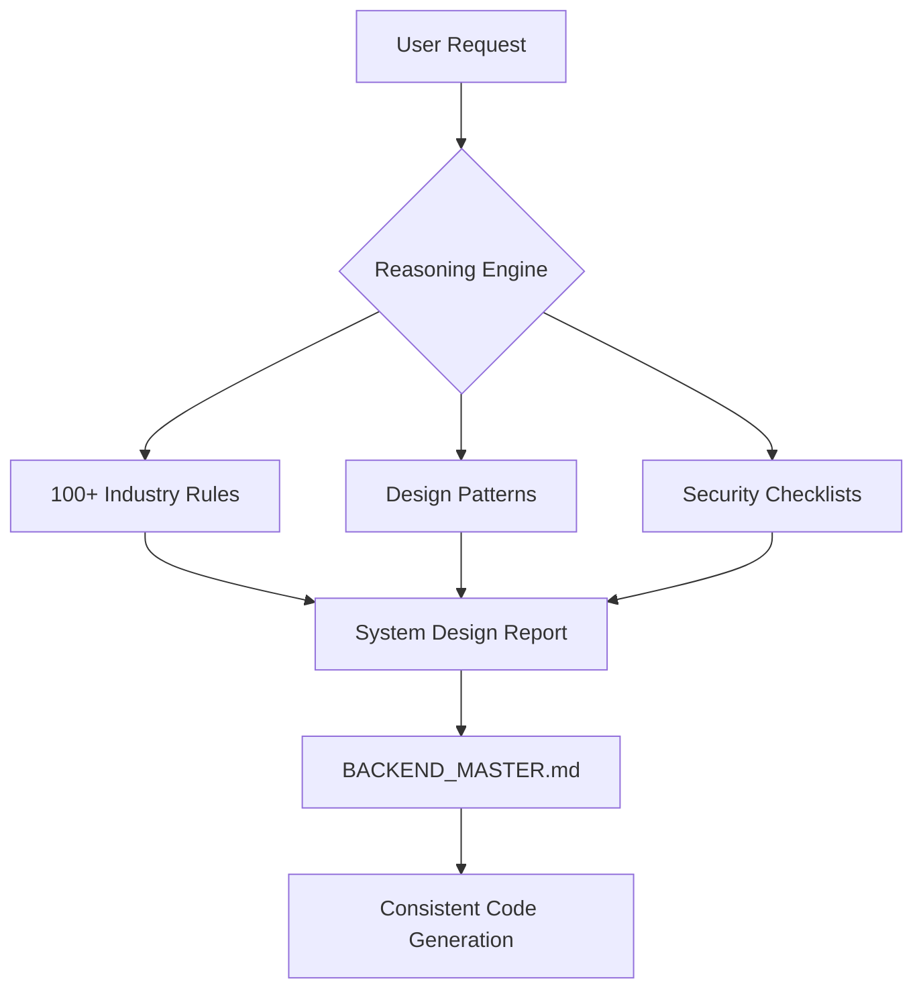

# 🧠 Backend Pro Max Skill v2.0 (Extreme Detail)

> **The Ultimate Backend Intelligence Hub for AI Coding Agents.**
> **Copyright © 2026 Odin from Dsoft Team.**
> Nâng tầm AI của bạn từ "Coder" thành "Senior Backend Architect" với kho tri thức 100+ lĩnh vực.

---

## 🚀 Tính năng nổi bật (v2.0)

### 1. Intelligent System Design Generation
Cơ chế lập luận AI tự động phân tích yêu cầu dự án và đề xuất toàn diện: Architecture, Stack, Database, Security, và Anti-patterns.

### 2. 100+ Industry-Specific Reasoning Rules
Dữ liệu lập luận chuyên sâu cho mọi ngành nghề:
- **Finance**: Fintech, Banking, Crypto, Trading.
- **Healthcare**: EHR, Telemedicine, Pharma.
- **SaaS**: Micro SaaS, B2B Enterprise, DevTools.
- **Emerging**: AI/ML, Web3, IoT, Quantum Computing.

### 3. Architecture Persistence (`BACKEND_MASTER.md`)
Lưu trữ "Nguồn sự thật" (Source of Truth) cho kiến trúc dự án xuyên suốt các phiên chat, đảm bảo AI không bao giờ quên các quyết định thiết kế quan trọng.

---

## 🛠️ Cách cài đặt (3 Cách)

### 🚀 Cách 1: One-line Installer (Khuyên dùng - Không cần Node.js)
Cài đặt siêu tốc bằng 1 dòng lệnh duy nhất.

**Windows (PowerShell):**
```powershell
iwr -useb https://raw.githubusercontent.com/nextlevelbuilder/backend-promax-skill/main/install.ps1 | iex
```

**Mac / Linux:**
```bash
curl -fsSL https://raw.githubusercontent.com/nextlevelbuilder/backend-promax-skill/main/install.sh | sh
```

### 📦 Cách 2: NPM CLI (Chuẩn cho Node.js dev)
Nếu bạn đã có Node.js:
```bash
npx backend-promax-skill init
```

### 📂 Cách 3: Script nội bộ
Nếu tải source về máy:
```powershell
.\install_to_project.ps1 -TargetProject "C:\du-an-cua-ban"
```

---

## 🧩 Hỗ trợ đa nền tảng (Multi-Agent Support)

| Trợ lý AI | Cách sử dụng |
| :--- | :--- |
| **Antigravity** | Sử dụng Slash Commands `/backend-pro-max`, `/backend-db`, `/backend-secure` |
| **Cursor IDE** | Tự động qua `.cursorrules` hoặc gõ `@Rules /reason` |
| **Claude Code** | Tự động nhận diện qua `.claude/skills/` |
| **Windsurf** | Tích hợp qua `.windsurf/workflows/backend-promax.md` |
| **Trae IDE** | Tương thích qua `.trae/skills/backend-promax/` |
| **GitHub Copilot** | Tích hợp qua `.github/prompts/backend-promax.prompt.md` |
| **Gemini CLI** | Tự động qua `.gemini/skills/backend-promax/` |
| **Roo Code** | Tích hợp qua `.roo/rules/backend-promax.md` |
| **Kiro** | Tích hợp qua `.kiro/steering/backend-promax.md` |
| **Qoder** | Tích hợp qua `.qoder/skills/backend-promax.md` |
| **Codex CLI** | Tích hợp qua `.codex/skills/backend-promax/` |

---

## 🎨 Kiến trúc hệ thống



---

## 💡 Ví dụ câu lệnh "Pro Max"

- `/backend-pro-max "Fintech" "MoneyGuard"` (Tạo kiến trúc Fintech chuyên nghiệp)
- `/backend-db "Time-series data for IoT"` (Chọn database tối ưu cho IoT)
- "Dựa trên quy tắc v2.0, hãy thiết kế logic Idempotency cho hệ thống thanh toán này."

---
> [!IMPORTANT]
> Backend Pro Max v2.0 không chỉ viết code, nó **thiết kế hệ thống**. Đảm bảo dự án của bạn luôn đạt chuẩn Senior về độ tin cậy và hiệu năng.
