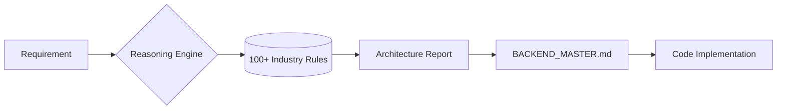

<div align="center">
  <h1>Backend Pro Max Skill</h1>
  <p><b>The Ultimate Backend Intelligence Hub for AI Coding Agents.</b></p>
  <p>
    
    
    
  </p>
  <p><i>Level up your AI Assistant from a simple coder to a <b>Senior Backend Architect</b>.</i></p>
</div>

---

## 💎 What's New in v2.0?

### 🧠 Intelligent System Design Generation
The flagship feature of v2.0 is the **Architecture Reasoning Engine** - an AI-powered brain that analyzes project requirements and generates a complete, high-level system design in seconds.

```text
+----------------------------------------------------------------------------------------+
| TARGET: MoneyGuard - RECOMMENDED BACKEND ARCHITECTURE                                  |
+----------------------------------------------------------------------------------------+
|                                                                                        |
| DOMAIN: Fintech (High Sensitivity)                                                     |
| PATTERN: Event-Driven Architecture (EDA) + Micro-segmentation                          |
|                                                                                        |
| CORE STACK:                                                                            |
|   - Language: Go (Fiber) / Rust (Actix)                                                |
|   - Messaging: Apache Kafka / RabbitMQ                                                 |
|   - Auth: OAuth2 + OIDC (Keycloak)                                                     |
|                                                                                        |
| DATABASE STRATEGY:                                                                     |
|   - Primary: PostgreSQL (ACID compliant)                                               |
|   - Caching: Redis (Cluster mode)                                                      |
|   - Immutable: Amazon QLDB (Ledger for transactions)                                   |
|                                                                                        |
| SECURITY PROTOCOLS:                                                                    |
|   - Encryption: AES-256 (At rest) + mTLS (In transit)                                  |
|   - Resilience: Circuit Breakers + Throttling                                          |
|                                                                                        |
| ANTI-PATTERNS TO AVOID:                                                                |
|   - [!] No Firebase for core financial ledger                                          |
|   - [!] No client-side balance calculations                                            |
|                                                                                        |
| PRE-DELIVERY CHECKLIST:                                                                |
|   [ ] Idempotency keys implemented on all write APIs                                   |
|   [ ] Distributed Tracing (OpenTelemetry) configured                                   |
|   [ ] Secrets managed via HashiCorp Vault                                              |
|                                                                                        |
+----------------------------------------------------------------------------------------+
```

---

## 🔥 Features

- **100+ Industry Rules**: Expert reasoning for Fintech, HealthTech, SaaS, Web3, AI platforms, and more.
- **Architecture Persistence**: Decisions are auto-saved to `BACKEND_MASTER.md` so your AI never forgets.
- **Security Deep Dive**: Hardened checklists based on OWASP Top 10 and industry-specific compliance (HIPAA, PCI-DSS).
- **Performance Tuning**: Intelligent recommendations for indexing, caching, and low-latency throughput.
- **Multi-Agent Support**: Native integration for 11+ different AI coding assistants.

---

## 🛠️ Installation

### Using CLI (Recommended)
Install and initialize in seconds:

```bash
# Install via npx (No global install needed)
npx backend-promax-skill init

# OR use the One-line Installer (No Node.js required)
# Windows (PowerShell):
iwr -useb https://raw.githubusercontent.com/dsoftodin22999/backend-promax-skill/main/install.ps1 | iex

# Mac / Linux:
curl -fsSL https://raw.githubusercontent.com/dsoftodin22999/backend-promax-skill/main/install.sh | sh
```

---

## 🧩 How to Use with AI Agents

| Assistant | Integration Method |
| :--- | :--- |
| **Antigravity** | Use Slash Commands: `/backend-pro-max`, `/backend-db`, `/backend-secure` |
| **Cursor / Windsurf** | Use Slash Command: `/backend-pro-max [industry] [project]` |
| **Claude Code** | Automatic via `.claude/skills/` |
| **GitHub Copilot** | Select from prompts menu or type `@backend-promax` |
| **Gemini / Roo Code** | Native support via custom rules folders |
| **Trae IDE** | Integrated via `.trae/skills/` (Beta) |

---

## 💡 Example Power Prompts

- `"/backend-pro-max 'Fintech' 'CryptoExchange'"`
- `"Based on the database-decision-matrix, pick the best storage for a real-time chat app."`
- `"Audit my current code against the security pre-delivery checklist."`
- `"Generate an Idempotency strategy for this payment integration."`

---

## 🎨 System Flow



---

<div align="center">
  <p>Copyright © 2026 <b>Odin from Dsoft Team</b></p>
  <p><i>"Don't just write code. Architect systems."</i></p>
</div>
