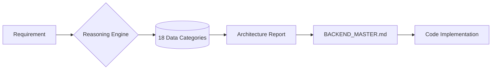

<div align="center">
  <h1>Backend Pro Max Skill</h1>
  <p><b>Backend Intelligence Hub for AI Coding Agents</b></p>
  <p>
    
    
    
  </p>
  <p><i>Transform your AI assistant into a backend architecture expert.</i></p>
</div>

---

## What's New in v2.0

### Intelligent System Design Generation
The flagship feature of v2.0 is the **Architecture Reasoning Engine** - an AI-powered system that analyzes project requirements and generates comprehensive system designs.

```text
+----------------------------------------------------------------------------------------+
| TARGET: MoneyGuard - RECOMMENDED BACKEND ARCHITECTURE                                  |
+----------------------------------------------------------------------------------------+
|                                                                                        |
| DOMAIN: Fintech (High Sensitivity)                                                     |
| PATTERN: Event-Driven Architecture (EDA) + Micro-segmentation                          |
|                                                                                        |
| CORE STACK:                                                                            |
|   - Language: Go (Fiber) / Rust (Actix)                                                |
|   - Messaging: Apache Kafka / RabbitMQ                                                 |
|   - Auth: OAuth2 + OIDC (Keycloak)                                                     |
|                                                                                        |
| DATABASE STRATEGY:                                                                     |
|   - Primary: PostgreSQL (ACID compliant)                                               |
|   - Caching: Redis (Cluster mode)                                                      |
|   - Immutable: Amazon QLDB (Ledger for transactions)                                   |
|                                                                                        |
| SECURITY PROTOCOLS:                                                                    |
|   - Encryption: AES-256 (At rest) + mTLS (In transit)                                  |
|   - Resilience: Circuit Breakers + Throttling                                          |
|                                                                                        |
| ANTI-PATTERNS TO AVOID:                                                                |
|   - [!] No Firebase for core financial ledger                                          |
|   - [!] No client-side balance calculations                                            |
|                                                                                        |
| PRE-DELIVERY CHECKLIST:                                                                |
|   [ ] Idempotency keys implemented on all write APIs                                   |
|   [ ] Distributed Tracing (OpenTelemetry) configured                                   |
|   [ ] Secrets managed via HashiCorp Vault                                              |
|                                                                                        |
+----------------------------------------------------------------------------------------+
```

---

## Features

- **100+ Industry Rules**: Architecture reasoning for Fintech, HealthTech, SaaS, Web3, AI platforms, E-commerce, and more.
- **18 Data Categories**: Comprehensive CSV knowledge base covering architecture, databases, security, testing, cloud patterns, and observability.
- **Architecture Persistence**: Decisions are automatically saved to `BACKEND_MASTER.md` for reference.
- **Security Protocols**: Hardened checklists based on OWASP Top 10, HIPAA, PCI-DSS, and GDPR.
- **Performance Optimization**: Intelligent recommendations for indexing, caching, and low-latency throughput.
- **Testing Strategies**: Unit, integration, E2E, performance, and security testing patterns.
- **Cloud Patterns**: AWS, GCP, Azure, and multi-cloud architecture recommendations.
- **Multi-Agent Support**: Native integration for 11+ AI coding assistants.

---

## Installation

### Using CLI (Recommended)

Navigate to your project directory and run:

```bash
cd /path/to/your/project
npx backend-promax-skill init
```

### One-line Installer (No Node.js Required)

**Windows (PowerShell):**
```powershell
cd C:\path\to\your\project
iwr -useb https://raw.githubusercontent.com/dsoftodin22999/backend-promax-skill/main/install.ps1 | iex
```

**Mac / Linux:**
```bash
cd /path/to/your/project
curl -fsSL https://raw.githubusercontent.com/dsoftodin22999/backend-promax-skill/main/install.sh | sh
```

### Local Installation (From Cloned Repo)

```powershell
.\install_to_project.ps1 -TargetProject "C:\path\to\your\project"
```

> 📖 **For detailed integration instructions, see [INTEGRATION.md](INTEGRATION.md)**

---

## Quick Start Guide

### Step 1: Install to Your Project

```bash
cd my-project
npx backend-promax-skill init
```

### Step 2: Open Your AI Coding Assistant

Open your project in **Cursor**, **Windsurf**, **Claude Code**, or any supported AI agent.

### Step 3: Generate Architecture

Type in the chat:

```
/backend-pro-max "E-commerce" "MarketplaceApp"
```

### Step 4: Review the Output

Check the generated `BACKEND_MASTER.md` file for your architecture recommendations.

### Step 5: Continue Development

Ask follow-up questions:

```
"Based on BACKEND_MASTER.md, create the initial folder structure."
```

```
"Implement the database schema following the architecture report."
```

---

## Available Commands

| Command | Description | Example |
| :--- | :--- | :--- |
| `/backend-pro-max [industry] [project]` | Generate full architecture report | `/backend-pro-max "Fintech" "PaymentApp"` |
| `/backend-db [data_type]` | Database selection recommendation | `/backend-db "real-time chat"` |
| `/backend-secure` | Security audit of current code | `/backend-secure` |
| `/backend-test [project_type]` | Testing strategy recommendations | `/backend-test "microservices"` |
| `/backend-cloud [service]` | Cloud service comparison | `/backend-cloud "compute"` |
| `/backend-observability` | Observability tool recommendations | `/backend-observability` |

---

## AI Agent Integration

| Agent | Integration Method |
| :--- | :--- |
| **Antigravity** | Slash Commands: `/backend-pro-max`, `/backend-db`, `/backend-secure` |
| **Cursor / Windsurf** | Slash Command: `/backend-pro-max [industry] [project]` |
| **Claude Code** | Automatic via `.claude/skills/` |
| **GitHub Copilot** | Select from prompts menu or type `@backend-promax` |
| **Gemini CLI** | Native support via `.gemini/skills/` |
| **Kiro** | Integrated via `.kiro/steering/` |
| **Roo Code** | Native support via `.roo/rules/` |
| **Codex CLI** | Integrated via `.codex/skills/` |
| **Qoder** | Integrated via `.qoder/skills/` |
| **Trae IDE** | Integrated via `.trae/skills/` |

---

## Example Prompts

**Generate Architecture:**
```
/backend-pro-max "Fintech" "CryptoExchange"
```

**Database Selection:**
```
Based on the database-decision-matrix, recommend the optimal storage for a real-time chat application.
```

**Security Audit:**
```
Audit my current API code against the security checklist.
```

**Testing Strategy:**
```
What testing strategy should I use for this microservices architecture?
```

**Cloud Recommendations:**
```
Compare AWS Lambda vs Cloud Run for my serverless API.
```

---

## Knowledge Base

The skill includes 18 comprehensive data files:

| Category | Files |
| :--- | :--- |
| **Architecture** | `backend-reasoning.csv`, `architecture-patterns.csv`, `tech-stacks.csv` |
| **Database** | `database-decision-matrix.csv`, `caching-strategies.csv` |
| **Security** | `security-deep-dive.csv`, `anti-patterns.csv` |
| **Performance** | `performance-optimization-guide.csv`, `reliability-strategies.csv` |
| **API Design** | `api-design-guidelines.csv`, `api-versioning-guide.csv`, `error-handling-patterns.csv` |
| **Testing** | `testing-strategies.csv` |
| **Cloud** | `cloud-patterns.csv` |
| **Observability** | `observability-stack.csv` |
| **DevOps** | `devops-deployment.csv` |
| **Edge Cases** | `edge-case-reasoning.csv`, `pre-delivery-checklist.csv` |

---

## Running the Reasoning Engine Manually

You can run the reasoning engine directly using Python:

```bash
# Generate architecture report
python .shared/backend-promax/search_logic.py "Fintech" --system-design --project "MyApp" --persist

# Search for database recommendations
python .shared/backend-promax/search_logic.py "cache" --domain database-decision-matrix

# Search for security guidelines
python .shared/backend-promax/search_logic.py "authentication" --domain security-deep-dive

# Search for testing strategies
python .shared/backend-promax/search_logic.py "api" --domain testing-strategies
```

---

## System Flow



---

## Documentation

- **[INTEGRATION.md](INTEGRATION.md)** - Detailed integration guide
- **[CLAUDE.md](CLAUDE.md)** - Quick reference for Claude Code users

---

## License

MIT License - See [LICENSE](LICENSE) for details.

---

<div align="center">
  <p>Copyright © 2026 <b>Odin from Dsoft Team</b></p>
</div>
